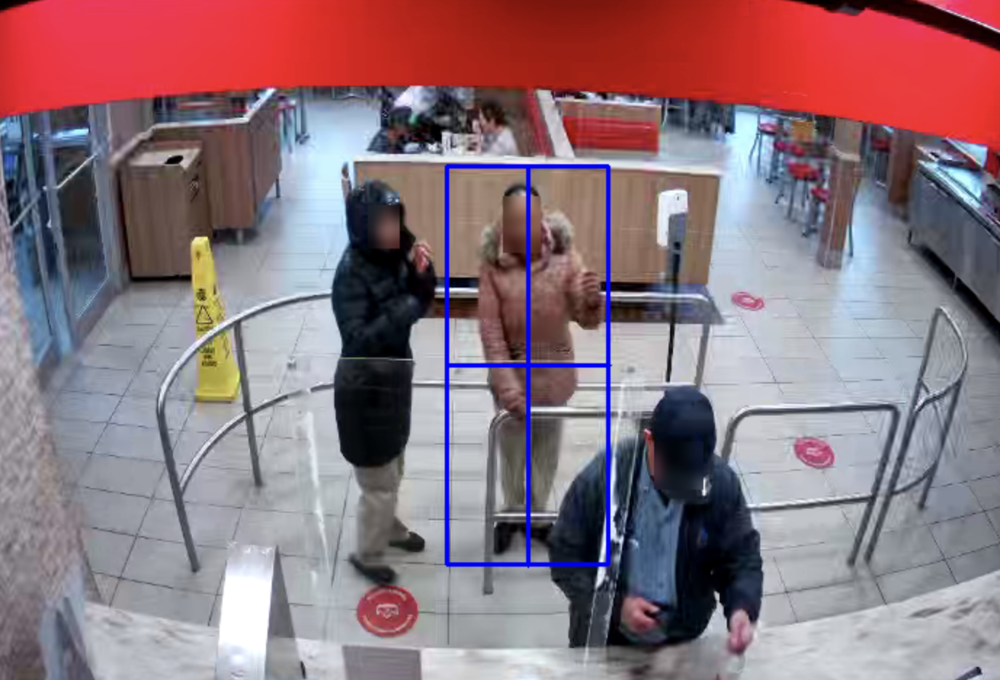

#Video Object Identification using Histograms

--- 




## Project Phase 1 Description

In this initial phase of the project, 
the task is to utilize histograms to identify individuals 
within a pre-detected video sequence using OpenCV (Open Source Computer Vision Library) an open-source computer vision and machine learning software library. 

The process involves calculating histograms for each individual in the images and subsequently using them to detect the same individuals in other images within the sequence. The choice of histogram to use is at your discretion, 
but it should have between 16 and 1024 entries. 
Possible color spaces include grayscale, reduced RGB, HSB (or just H or HS), YUV by separating Y and UV, etc. In

In this first iteration of this proejct, we reduced to grayscale for all histograms.

 


--- 


### 📎 Prerequisites
Make sure you have [Python](https://www.python.org/downloads/) installed on your system.

### Clone the Repository
```bash
git clone <repository-url>
cd <repository-directory>
```

### Install Dependencies

```bash
pip install opencv-python
```

### Run
```bash
python main.py
```


---

### 🚀 Project Construction
English Description available below. 
### Projet Reconnaissance de Personnes par Histogrammes Vidéo


Ce project suggère beaucoup de liberté pour la structure du projet. Premièrement j'ai exploré plusieurs sous-problèmes afin 
de comprendre l'énoncé du problème. 

- comparaison d'histogrammes avec OpenCV
- grabcut et le ROI Selection Tool

Il est demandé de dans cette première partie projet, d'utiliser les histogrammes afin d'identifier les personnes dans un vidéo.

- Vous disposez donc d'une séquence d'images dans laquelle les personnes ont été déjà détectée dans le dossier subsquence_cam1.
- Un fichier texte vous donne la position de ces personnes dans chaque images soit dans le dossier test_images.


Alors voici la logique du programme: 

1. objectLocationSelector.py
    - demande l'utilisateur de selectionner tous personnes que l'on veut identifier dans notre séquence d'images
    - cela retourne un ficher text (labelstest.txt) des images et la locations (x,y,h,w) 
2. HistogramCalculatorSub.py
    - prend le fichier text de test d'images avec son ficher d'images associer et calcule 2 histogrames de chaque persones dnas l'images
    - prend le fichier text (labels.txt) ave sont fichiner d'images associer (subsequence_cam1) et calcule 2 histogrames de chaque personnes dans l'images
    - cela retourne pour chaque processus un fichier des histogrames de chaque objects.
3. compaisonHistogram.py (comparaison...)
    - compare les deux nouveaux fichier .txt générer de HistogramCalultorSub
    - retourne resultats.txt avec le pourcentage de similarité.
4. Nous avons aussi une test d'erreur image - imgtext.png qui est un image completement differente. On peut voir que les res retourne 0%. 


Example du fichier resultat.txt: 


Image imgtest (false image test)
Object 6 coordinates: (45, 151, 1634, 1854)
- Similar image: 1636738303879021100, Percentage of similarity: 0.00%
- Similar image: 1636738304097761800, Percentage of similarity: 0.00%
- Similar image: 1636738304316504300, Percentage of similarity: 0.00%

Image 1636738357390407600 (image test)
Object 212 coordinates: (304, 240, 152, 229)
- Similar image: 1636738303879021100, Percentage of similarity: 179.67%
- Similar image: 1636738304097761800, Percentage of similarity: 179.67%
- Similar image: 1636738304316504300, Percentage of similarity: 179.67%
- Similar image: 1636738304535246400, Percentage of similarity: 137.00%


--- 


English Description


This project suggests a lot of freedom in structuring the project. Firstly, I explored several sub-components to understand the overall problem statement:

Histogram comparison with OpenCV
GrabCut and the ROI Selection Tool
In this first part of the project, the task is to use histograms to identify individuals within a video.

You have a sequence of images in which individuals have already been detected in the "subsequence_cam1" folder.
A text file provides the position of these individuals in each image, located in the "test_images" folder.
Here's the logic of the program:

objectLocationSelector.py

Prompts the user to select all the individuals we want to identify in our sequence of images.
This returns a text file (labelstest.txt) containing the images and their locations (x, y, h, w).
HistogramCalculatorSub.py

Takes the test image text file with its associated image file and calculates 2 histograms for each person in the images.
Takes the text file (labels.txt) with its associated image file (subsequence_cam1) and calculates 2 histograms for each person in the images.
This returns a file of histograms for each object for each process.
comparisonHistogram.py

Compares the two new text files generated by HistogramCalculatorSub.
Returns resultats.txt with the percentage of similarity.
We also have an error test image (imgtext.png), which is a completely different image. We can see that the results return 0%.

Example of the resultat.txt file:


Image imgtest (false image test)
Object 6 coordinates: (45, 151, 1634, 1854)
- Similar image: 1636738303879021100, Percentage of similarity: 0.00%
- Similar image: 1636738304097761800, Percentage of similarity: 0.00%
- Similar image: 1636738304316504300, Percentage of similarity: 0.00%

Image 1636738357390407600 (image test)
Object 212 coordinates: (304, 240, 152, 229)
- Similar image: 1636738303879021100, Percentage of similarity: 179.67%
- Similar image: 1636738304097761800, Percentage of similarity: 179.67%
- Similar image: 1636738304316504300, Percentage of similarity: 179.67%
- Similar image: 1636738304535246400, Percentage of similarity: 137.00%


---


### 📎 Project Prerequisites

#### Email: cdugu093@uottawa.ca
### Project done by Celeste Duguay

